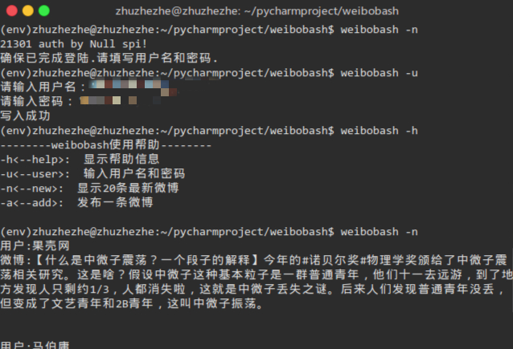

# weibobash
一款命令行界面下发布微博获取最新微博的工具

*感谢开源项目[weibo](https://github.com/lxyu/weibo)提供支持*

### 功能
0.1版本: 支持linux系统bash命令行下获取最新微博，发布微博的功能。

### 安装
安装支持python>=3

`$pip install weibobash`

### 使用
**务必首先运行`$weibobash -u`输入用户名和密码以登陆**

命令下使用`$weibobash <参数>`运行相应功能。

--------weibobash使用帮助--------

-h<--help>:  显示帮助信息

-u<--user>:  输入用户名和密码

-n<--new>:  显示20条最新微博

-a<--add>:  发布一条微博

### 效果

### 许可
**MIT**

### 联系我
[个人网站](http://blog.zhuzhezhe.cc)

邮箱：zhuzhezhe95@163.com

